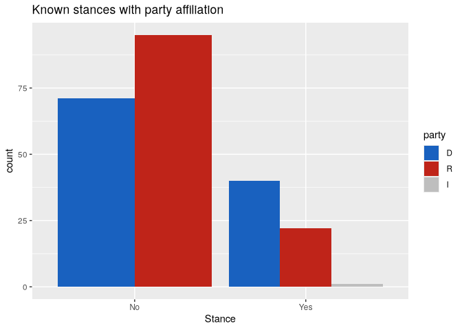
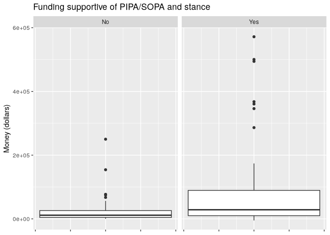
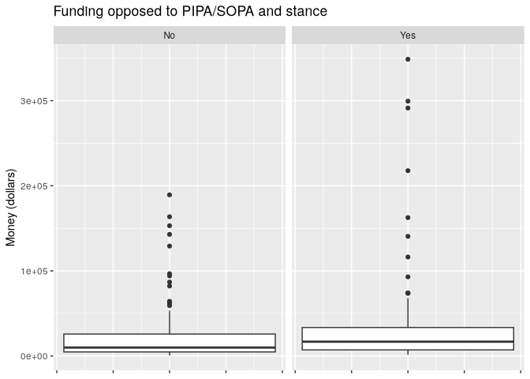
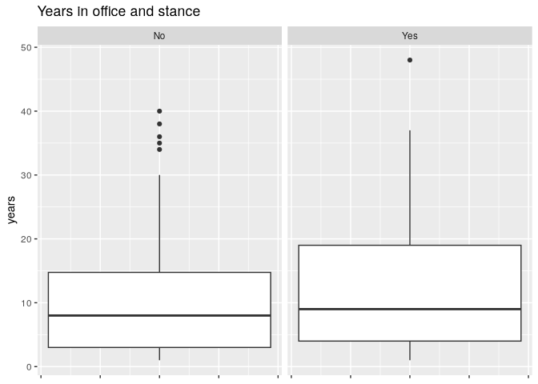
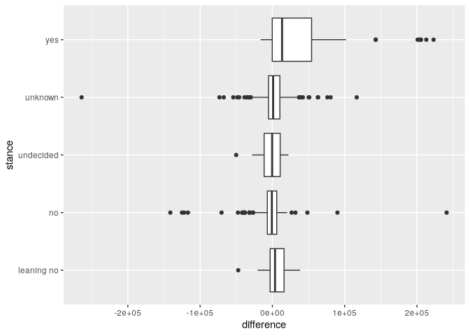

Piracy and PIPA/SOPA
================
Christian AumanNate MillerNathanSimran Gautam
April 25, 2026


# Introduction

PIPA and SOPA were proposed laws intended to address online piracy, but
they also created major debate about internet regulation, copyright
enforcement, and political influence. In this project, we investigate
whether political funding is associated with legislators stances on
PIPA/SOPA. To answer this question, we use the `piracy` dataset from
[openintro.org](https://www.openintro.org/data/index.php?data=piracy),
which includes information about U.S. legislators, their party, state,
chamber, years in office, funding received from pro- and anti-PIPA/SOPA
groups, and their stance on the issue.

## Project Motivation

This question matters because political decisions may be influenced by
many factors, including party affiliation, ideology, public opinion, and
campaign funding. Finding the factors at play helps us understand how
political decisions can be influenced.

To study this, we compare pro-PIPA/SOPA funding and anti-PIPA/SOPA
funding for each legislator. In our analysis, we calculate a funding
difference variable using `money_pro - money_con`, where positive values
mean that a legislator received more pro-PIPA/SOPA funding than
anti-PIPA/SOPA funding. We then use exploratory plots and a linear
regression model to test whether this funding difference, or whether any
other factors are associated with stance.

# Discussion

## Data Source and Variables

**Source:** The dataset used in this project is called “piracy” and is
available as an R dataset. It contains information about U.S.
politicians including their party, funding, and stance on an issue.

**Context:** This dataset represents political data for members of the
House and Senate. It includes information about how much money
politicians receive (supporting and opposing), their political party,
and their stance (yes, no, or unknown).

**Population vs Sample:** The dataset represents the population of
legislators included in this study because it contains all legislators
recorded in the dataset. However, for the statistical analyses, the
subset of legislators with clear “yes” or “no” stances after removing
“unknown” responses can be treated as the sample used for analysis.

**Size of Dataset:**

- Number of observations: 534
- Number of variables: 8

**Variables Description:**

- name: Name of politician
- party: Political party (D, R, I)
- state: State represented
- money_pro: Money supporting
- money_con: Money opposing
- years: Years in office
- stance: Position (yes, no, etc.)
- chamber: House or Senate

------------------------------------------------------------------------

## Data Cleaning and Preparation

``` r
# Load data
data(piracy)

data <- piracy
# View data
head(data)
```

    ## # A tibble: 6 × 8
    ##   name              party state money_pro money_con years stance  chamber
    ##   <chr>             <fct> <fct>     <dbl>     <dbl> <int> <fct>   <fct>  
    ## 1 Ackerman, Gary    " D"  NY        13350     14800    30 unknown house  
    ## 2 Adams, Sandra     " R"  FL         3500      5650     2 unknown house  
    ## 3 Aderholt, Robert  " R"  AL         4779     23944    16 unknown house  
    ## 4 Akin, Todd        " R"  MO         2500      8200    12 no      house  
    ## 5 Alexander, Rodney " R"  LA         3500      2700    10 no      house  
    ## 6 Altmire, Jason    " D"  PA        24250     10650     6 unknown house

``` r
# Size
dim(data)
```

    ## [1] 534   8

``` r
# Structure
str(data)
```

    ## tibble [534 × 8] (S3: tbl_df/tbl/data.frame)
    ##  $ name     : chr [1:534] "Ackerman, Gary" "Adams, Sandra" "Aderholt, Robert" "Akin, Todd" ...
    ##  $ party    : Factor w/ 3 levels " D"," R"," I": 1 2 2 2 2 1 2 2 1 2 ...
    ##  $ state    : Factor w/ 50 levels "AK","AL","AR",..: 34 9 2 24 18 38 22 33 31 35 ...
    ##  $ money_pro: num [1:534] 13350 3500 4779 2500 3500 ...
    ##  $ money_con: num [1:534] 14800 5650 23944 8200 2700 ...
    ##  $ years    : int [1:534] 30 2 16 12 10 6 2 2 24 4 ...
    ##  $ stance   : Factor w/ 5 levels "leaning no","no",..: 4 4 4 2 2 4 2 5 2 4 ...
    ##  $ chamber  : Factor w/ 2 levels "house","senate": 1 1 1 1 1 1 1 1 1 1 ...

``` r
# Summary
summary(data)
```

    ##      name           party        state       money_pro        money_con          years              stance      chamber   
    ##  Length:534          D:243   CA     : 55   Min.   : -5000   Min.   : -1000   Min.   : 1.00   leaning no: 44   house :434  
    ##  Class :character    R:289   TX     : 34   1st Qu.:  4500   1st Qu.:  4500   1st Qu.: 4.00   no        :122   senate:100  
    ##  Mode  :character    I:  2   NY     : 31   Median : 11700   Median : 10200   Median :10.00   undecided : 11               
    ##                              FL     : 27   Mean   : 26326   Mean   : 23193   Mean   :11.76   unknown   :294               
    ##                              IL     : 21   3rd Qu.: 27462   3rd Qu.: 23947   3rd Qu.:18.00   yes       : 63               
    ##                              PA     : 21   Max.   :571600   Max.   :550000   Max.   :58.00                                
    ##                              (Other):345   NA's   :14       NA's   :35

``` r
# Missing values
colSums(is.na(data))
```

    ##      name     party     state money_pro money_con     years    stance   chamber 
    ##         0         0         0        14        35         0         0         0

``` r
# Fix spaces
data$party <- trimws(data$party)

# Convert to factors
data$party <- as.factor(data$party)
data$state <- as.factor(data$state)
data$stance <- as.factor(data$stance)
data$chamber <- as.factor(data$chamber)

# Clean data
data_clean <- na.omit(data)

# Counts
table(data$party)
```

    ## 
    ##   D   I   R 
    ## 243   2 289

``` r
table(data$stance)
```

    ## 
    ## leaning no         no  undecided    unknown        yes 
    ##         44        122         11        294         63

``` r
table(data$chamber)
```

    ## 
    ##  house senate 
    ##    434    100

# Research Questions and Hypothesis

## Research Question

Our primary research question is: **Is funding associated with
legislators stances on PIPA/SOPA?**

We came up with this question because campaign funding is often
discussed as a possible influence on political decisions. Since the
dataset includes both funding information and legislator stance, we can
test whether there is a relationship between pro- and anti-PIPA/SOPA
funding and whether a legislator supported the bill.

## Our Hypothesis

We hope to model this relationship:
$$ stance = \beta_0 + \beta_1(difference) + \epsilon $$

Our hypotheses are: $$ H_0: \beta_1 = 0 $$ $$ H_A: \beta_1 \neq 0 $$

The null hypothesis $H_0$ is testing when difference of funding pro vs
con has no slope. The alternative hypothesis $H_A$ is testing when the
difference slope is not 0.

# Main Analyses

## Exploratory Data Analysis

### Bar chart for party relation to stance



### Box plots for funding relation to stance







## Statistical Methods

To answer our research question, we used linear regression to model a
relationship between stance and pro-funding vs con-funding.

Here we are modeling how stance relates to money-pro versus money-con.
To do this, we subtract money-con from money-pro. This means that
whenever the difference is positive, there is more money-pro for that
stance than money-con. If the difference is negative, then there is more
money-con than money-pro for that stance with the 3rd quartile extending
to ~1e+03.

To help visualize, we have a boxplot which shows the association between
the stance category and the difference between money-pro and money-con.
Here you can see that there is more money-pro than money-con associated
with the yes stance.



Next we produced a linear regression model which models the relationship
between the difference of money-pro versus money-con and stance.
However, because stance is a categorical variable, we converted it to a
variable called `stance_binary`. If stance was yes, stance_binary is 1.
If stance was no or leaning-no, `stance_binary` was 0. Anything else was
0.5. We also changed the difference to represent \$10k units instead of
\$1 units. This gives us a much nicer numerical result.

    ## lm(formula = stance_binary ~ difference, data = piracy_modified)

The coefficients produced by our model suggests a positive slope for the
funding difference, meaning more pro-funding versus con-funding is
associated with a closer to yes stance. For our model this means that
for every \$10k more money-pro funding than money-con funding, stance
was increased by ~0.023. Remember that stance is 0 for no, 0.5 for
unknown/undecided, and 1 for yes. So a positive slope means that the
positive funding difference is associated with a more yes-stance.

    ##              Estimate  Std. Error   t value      Pr(>|t|)
    ## (Intercept) 0.3852445 0.013855389 27.804666 6.848642e-103
    ## difference  0.0226156 0.003647424  6.200431  1.195309e-09

$R^2$:

    ## [1] 0.07261439

p-value:

    ## [1] 1.195309e-09

Our p-value is very small here, which means that if there *truly* was no
association between stance and difference, the probability of getting a
slope this large or larger is extremely small. Our results suggest that
if we modeled another population from another year, there would be a
positive association between the funding difference and stance. This
model suggests that legislators with more pro-funding relative to
con-funding tended to have stance scores closer to yes. However, $R^2$
only explains ~7% of variation in the stance, so funding difference is
not the only variable which is associated with stance.

# Conclusion (final answer, limitations, future work, why it matters)

Overall, our analysis suggests that legislators with more pro-PIPA/SOPA
funding relative to anti-PIPA/SOPA funding tended to have stance scores
closer to “yes.” Therefore, our main research question can be answered
by saying that funding is associated with stance, but we cannot say that
funding directly caused stance as this data is solely observational
data.

Given that the coefficient for the `difference` variable in pro vs con
funding was positive, and given that the $p-value$ is much less than
$\alpha$, we reject the null-hypothesis $H_0$, and conclude that funding
is positively associated with stance.

## Summary of Findings

The regression test found a positive relationship between funding
difference and stance. In other words, as pro-PIPA/SOPA funding
increased relative to anti-PIPA/SOPA funding, legislators tended to have
stances closer to supporting PIPA/SOPA.

The exploratory boxplot supported this finding visually. The “yes”
stance group had higher funding differences compared to the other stance
groups, meaning that legislators who supported PIPA/SOPA tended to have
more pro-funding relative to con-funding. The regression model confirmed
this pattern statistically with a very small p-value.

However, the $R^2$ value was only about 7%, meaning that funding
difference only explains a small amount of the variation in stance. So,
while funding is related to stance, many other factors likely influence
the legislators positions.

## Limitations and Future Work

s
